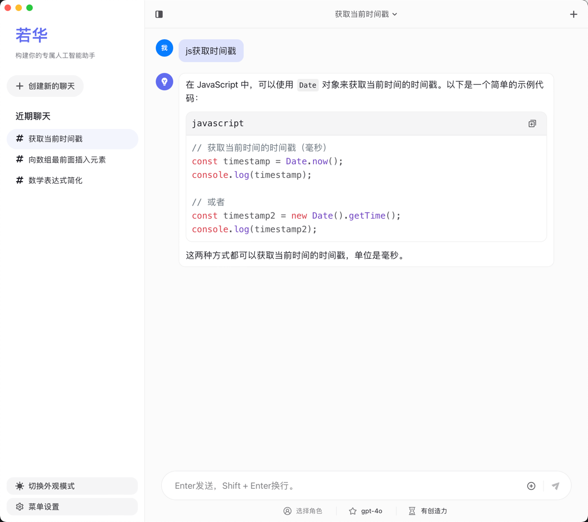
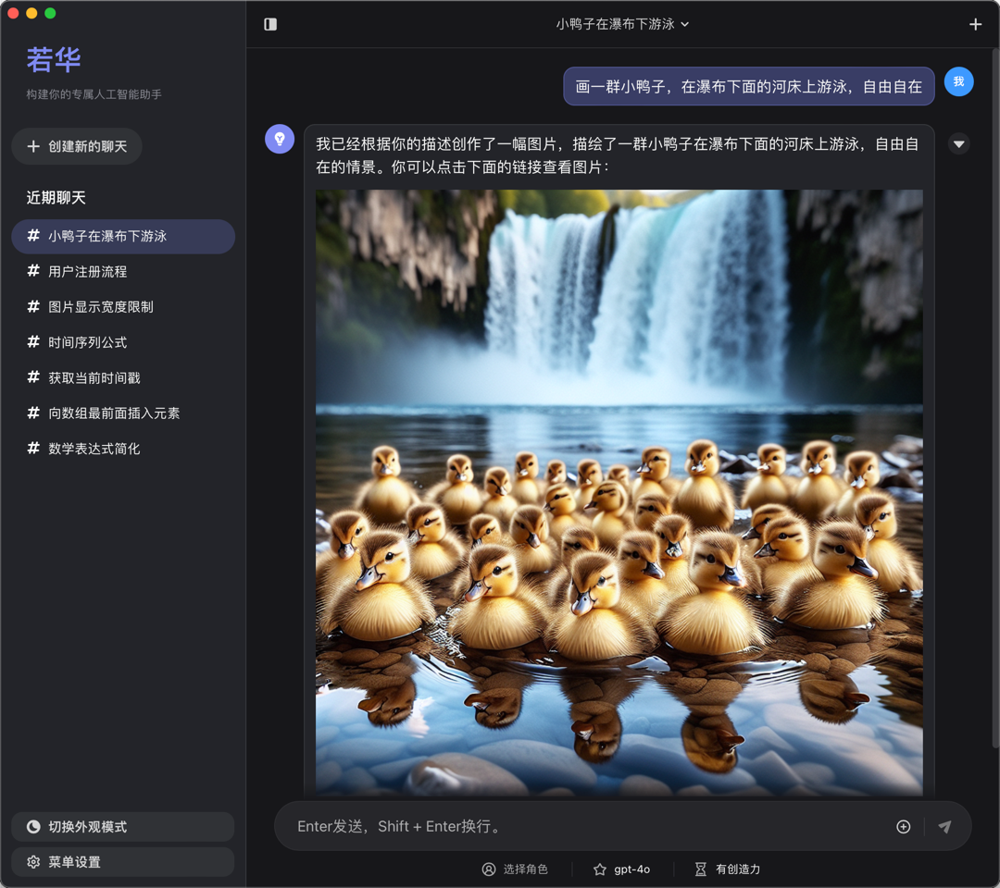
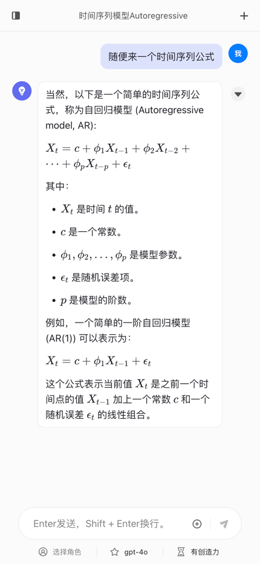
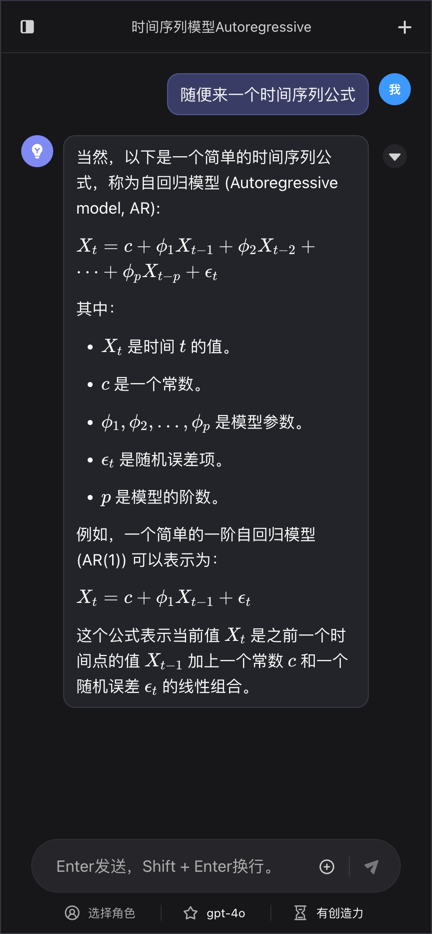

# rhua-chatgpt-web

一个基于react + semi ui + tauri开发的LLM对话工具，通过此工具可以快速构建你的专属人工智能助手。

## 主要特点

- 跨平台，支持mac、windows和linux，也支持直接在nginx上面运行静态web网页。
- 支持Markdown、代码高亮、LaTeX公式、Mermaid（思维导图、饼图、流程图等）的显示。
- 支持自定义插件，可以在工具内直接编写插件运行。
- 支持自定义角色（预设消息）。
- 支持视觉模型，可以在对话的消息中附带图片地址。
- 支持把对话列表转为图片分享。
- 简洁、现代的UI界面，兼容移动端显示，支持深/浅色外观。
- 隐私安全，所有数据保存在用户浏览器本地，对话请求直接发到OpenAI（支持OpenAI兼容接口）。

## 工具截图

| 浅色                                    | 深色                                   |
|---------------------------------------|--------------------------------------|
|  |  |
|  |  |

## 开始使用

1、打开工具或网页，第一次打开时窗口会提示配置API Key，点击后直接跳转到模型配置页面；

2、配置模型，模型默认是OpenAI的官网接口地址，用户也可以自定义兼容OpenAI的兼容接口，同时需要填入API Key；

3、点击配置页面右上角的“返回”按钮，返回对话页面后可与AI进行聊天对话。

### 自定义打包

#### 静态文件打包（可以直接放到nginx运行）
```
pnpm build
```

#### 软件打包（兼容macos、windows、linux）
```
pnpm tauri build
```

### 插件配置

插件基础信息可以随便填，这个是列表页展示用的，主要是要把执行函数配置正确，插件的执行逻辑是根据函数描述和参数描述来调用的，尽量写的准确一点。

<details>
  <summary>查看插件示例</summary>

#### Dall-E 3画图插件示例

##### 插件名
Dall-E 3画图

##### 函数名
dall-e3-draw-tool

##### 函数描述
图片创作小助手，并且对图片进行创作解读。

##### 函数入参
| 参数名                                     | 参数类型                                   | 参数描述 |
|-----------------------------------------|----------------------------------------|--|
| prompt   | 字符串 | 创作图片的提示词 |

##### 函数代码
``` 
// 注意apiUrl地址（可与模型配置里面的接口地址保持一致），还需换掉Authorization中的sk-xxx为自己的API Key
const apiUrl = "https://api.oneapi.com/v1/images/generations"; 
const requestOptions = {
  method: "POST",
  headers: {
    "Content-Type": "application/json",
    "Authorization": `Bearer sk-xxx`,
  },
  body: JSON.stringify({
    model: "dall-e-3",
    prompt: prompt,
    n: 1,
    size: "1024x1024",
  }),
};
const response = await fetch(apiUrl, requestOptions);
const json = await response.json();
return JSON.stringify(json.data); 
``` 
</details>

## 开发计划

先开源，待定中。。。